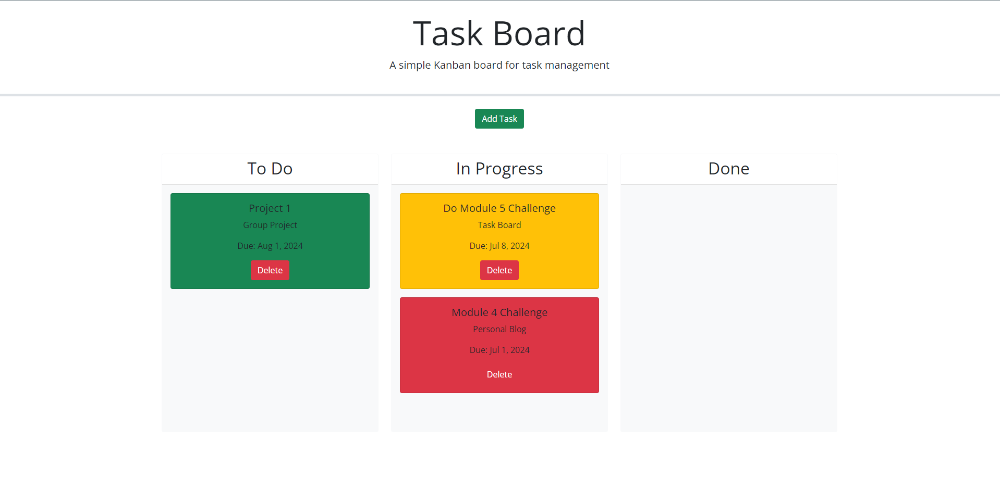

  
  # Task Board
  > Module 5 Challenge
  

  
  
  

  

## Description

In this web application, users can input tasks including:

- Title
- Description
- Due date

These tasks appear as 'card' elements and can be organized into three distinct swim lanes:

- To Do
- In Progress
- Done

Users have the flexibility to drag and drop these cards across different lanes as per their preferences. Additionally, the application notifies users with a yellow card if a task is due within 3 days, and with a red card if the task is overdue or due on the same day.

## Final Product

## Reference

- [USYD Bootcamp](https://techbootcamp.sydney.edu.au/coding/)
- [Bootstrap: Background Color](https://getbootstrap.com/docs/5.0/utilities/background/)
- [jQuery: Draggable](https://jqueryui.com/draggable/)
- [jQuery: Droppable](https://jqueryui.com/droppable/)

## Deploy

1. Access the HTML source code through the repo or within a Chromium/Firefox browser by pressing `F12` or `Control+Shift+I` (Windows) or `Command+Option+I` (MacOS). 

2. Click on this link http://leontran44.github.io/task-board/ to access to the deployment webpage.

## License
[MIT License](https://opensource.org/licenses/MIT)